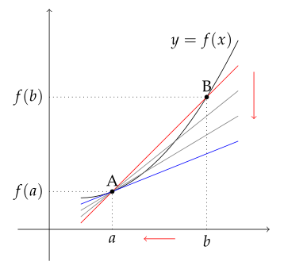
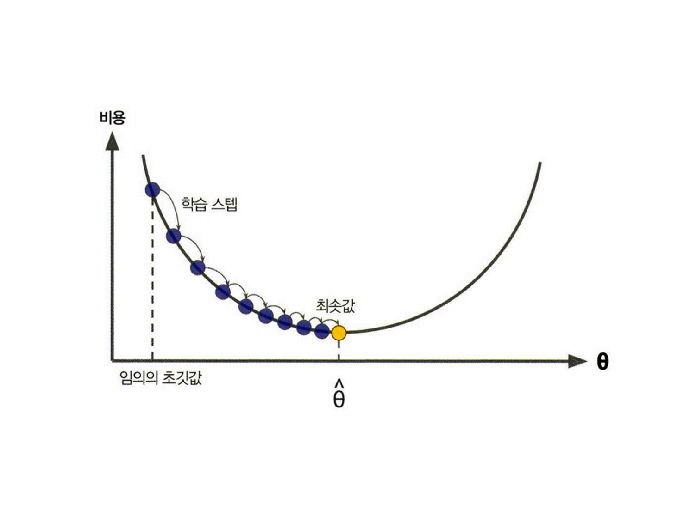
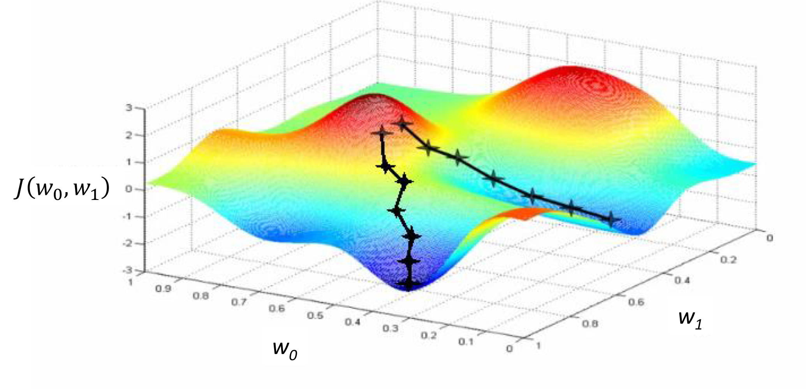
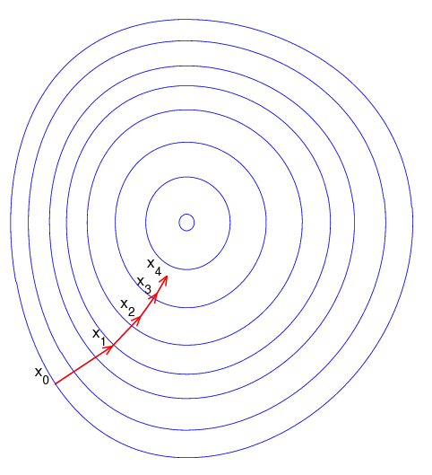
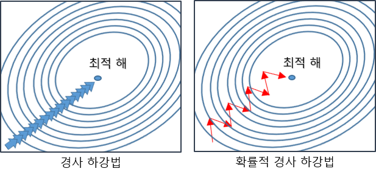

## 경사하강법
### 미분
변수의 움직임에 따른 함수값의 변화를 측정하기 위한 수식
- 최적화에서 가장 많이 사용하는 기법
- $f`(x) = \displaystyle\lim_{h \rarr 0} \frac{f(x+h) - f(x)}{h}$
- 한 점에서의 식별된 기울기를 통해 방향에 따른 증감 판별 가능

|B의 x 좌표가 A에 근접하여 A 접선의 기울기 역할로 변환|
|:-:|
||

### 편미분
벡터(다변수 함수)의 경우 편미분을 사용
- 특정 변수에 대한 미분 값 적용
  - 특정 변수를 제외한 나머지 변수는 전원 상수 취급
- $\partial{x_i}$ f(x) = $\displaystyle \lim_{h \rarr 0}\frac{f(x+he_i) - f(x)}{h}$

### 경사하강법(Gradient Descent; GD)
미분 값을 뺌으로써 함수의 극소값을 도출
- 그레디언트 벡터를 통해 경사하강법에 적용
- 극소값의 기울기는 0이므로 갱신이 되지 않아 종료조건에 해당
- 이론적으로 미분가능하고 볼록(convex)한 함수에 대해선 적절한 학습률과 학습 횟수를 바탕으로 수렴이 보장
- 특히 선형회귀의 경우 목적식은 회귀 계수 $\beta$에 대해 볼록함수이기 때문에 알고리즘을 충분히 돌리면 수렴이 보장
- 비선형회귀 문제의 경우 목적식이 볼록하지 않을 수 있으므로 일부에 대한 수렴을 보장

$\nabla f = (\partial x_1f, \partial x_1f, \dotsb, \partial x_1f)$

> 그레디언트 벡터: 편미분을 계산한 결과 벡터

#### 선형회귀
선형 회귀는 주어진 데이터로부터 y 와 x 의 관계를 가장 잘 나타내는 직선 도출

- 목적식
  - $||\bold{y - X}\beta||_2$
  - $\nabla _{\beta _k} ||\bold{y - X}\beta||_2 = \partial _{\beta _k} \{ \frac{1}{n} \displaystyle\sum _{i=1} ^{n} y_i - \displaystyle \sum _{j=1}^d X_{ij}\beta _j)^2\}^{1/2} = -\frac{\bold{X}_{\sdot k}^T(\bold{y-X}\beta)}{n||\bold{y-X}\beta||_2}$ 
  - $X_{\sdot k}^T$ : 행렬 X의 k번째 열(column) 벡터의 전치행렬
  - 최종적으로 $\bold{X}\beta$를 계수 $\beta$에 대해 미분한 결과인 $X^T$만 곱해지는 것
- 목적식을 최소화하는 $\beta$의 경사하강법 알고리즘
  - 다음 $\beta$ 는 현재 $\beta$에서 기울기에 비례한 값(학습률) 만큼 갱신
  - $\beta^{(t+1)} \larr \beta^{(t)}-\lambda\nabla_\beta ||\bold{y-X}\beta^{(t)}||$

|측면에서 볼 때(2D)|측면에서 볼 때(3D)|위에서 볼 때|
|:-:|:-:|:-:|
||||

### 확률적 경사하강법(Stochastic Gradient Descent; SGD)
모든 데이터를 사용해서 업데이트하는 대신, 데이터 한개 또는 일부(Mini-batch)를 활용하여 업데이트 진행
- 볼록이 아닌(non-convex) 목적식은 SGD를 통해 최적화 가능
- 데이터의 일부를 가지고 업데이트를 진행하므로 연산 자원을 보다 효율적으로 활용 가능
- 미니배치 크기가 수렴 속도에 영향
- 머신러닝 학습에 더욱 효율적
  - 일반적으로 모든 데이터를 메모리에 업로드할 시 OOM(Out-Of-Memory) 오류 발생
  - GPU에서 연산을 진행하는 사이 CPU는 전처리와 GPU에서 업로드 할 데이터를 준비

|확률적 경사하강법|
|:-:|
||