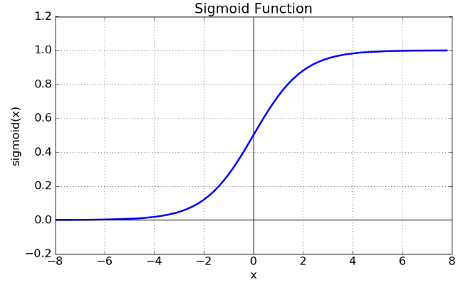

# 딥러닝 기초

## 벡터

### 스칼라
벡터 공간에서 벡터를 곱할 수 있는 양 혹은 특정 좌표계와 관련이 없는 양 · 변수

### 벡터
n차원 공간에서의 한 점을 표현하며, 숫자를 원소로 가지는 리스트(List)또는 배열(Array)
- 스칼라 곱을 통해 벡터의 크기, 방향을 조절
- 같은 크기에 대해 덧셈, 뺄셈, 성분곱, 스칼라곱 계산이 가능

> 성분곱: 각 위치에 해당하는 요소끼리의 곱

#### 벡터의 덧셈과 뺄셈
다른 벡터로부터 상대적 위치 이동

- $\vec{x} - \vec{y} = \vec{x} + (-\vec{y})$

### 벡터의 노름
원점에서부터의 거리
- L1 노름
  - 각 성분에 대한 변화량의 절대값의 모든 합
  - $||x||_1 = \sum|x_i|$
- L2 노름
  - 피타고라스 정리와 같은 유클리드 거리
  - $||x||_2 = \sqrt{\sum|x_i|^2}$

---
노름의 종류에 따라 기하학적 성질에 차이 발생

|Lp에 대한 노름|
|:-:|
||
||

$L_p = ||x||_p = (\Sigma{|x_i|^p})^{(1/p)}$

---

### L2 노름에서 두 벡터 사이의 각도
- 제 2 코사인 법칙을 이용한 각도 계산
  - $cos\theta = \frac{||x||_2^2 + ||y||_2^2 - ||x-y||_2^2}{2||x||_2||y||_2}$
- 내적을 통한 각도 계산
  - $cos\theta = \frac{\lt x, y \gt}{||x||_2 ||y||_2}$

### 내적
정사영된 $Proj(x)$벡터의 길이를 벡터 $y$의 길이 $||y||$ 만큼 조정한 값
- $\lt x, y \gt = ||x||_2 ||y||_2 cos \theta = ||x||_2 \cdot Proj(y)$

|a 벡터에 대한 정사영 $(\|a\|cos\theta)$|
|:-:|
||

## 행렬
### 행렬
벡터를 원소로 가지는 2차원 배열
- 행(row)과 열(column)의 인덱스로 구성
- 특정 행 혹은 열 한 줄은 행벡터 혹은 열벡터로 명명
- n차원 공간에서의 여러 점(데이터)을 의미
- 같은 크기에 대해 덧셈, 뺄셈, 성분곱, 스칼라곱 계산이 가능

$X = (x_{ij})$

### 전치 행렬(Transpose)
행과 열의 인덱스가 바뀐 행렬

$X = (x_{ji})$

### 행렬의 곱셈
i 번째 행벡터와 j 번째 열벡터의 내적을 성분으로 가지는 행렬을 계산
- 조건
  1. $X$의 열 개수와 $Y$의 행 개수가 동일하여야 한다.

- 특징
    1. 벡터를 다른 차원의 공간으로 전송할 수 있다.
    2. 패턴을 추출할 수 있다.
    3. 데이터를 압축할 수 있다.
    4. 모든 선형변환(linear transform)은 행렬곱으로 계산할 수 있다.

### 역행렬
행렬 $A$ 의 연산을 거꾸로 되돌리는 행렬
- $A^{-1}$로 표기
- 행과 열 숫자가 같고, 행렬식이 0이 아닌 경우 계산 가능
- $AA^{-1} = A^{-1}A = I$
- 연립방정식, 선형회귀 분석 등에 활용
- 역행렬을 계산할 수 없을 시 유사역행렬(pseudo-inverse) 또는 무어-펜로즈(Moore-Penrose) 역행렬 $A^+$를 이용
  - 무어-펜로즈
    - 행과 열의 크기가 달라도 가능
    - $A^+ = (A^TA)^{-1}A^T$ $(n \geq m)$
    - $A^+ = A^T(AA^T)^{-1}$ $(n \leq m)$

## 경사하강법
### 미분
변수의 움직임에 따른 함수값의 변화를 측정하기 위한 수식
- 최적화에서 가장 많이 사용하는 기법
- $f`(x) = \displaystyle\lim_{h \rarr 0} \frac{f(x+h) - f(x)}{h}$
- 한 점에서의 식별된 기울기를 통해 방향에 따른 증감 판별 가능

|B의 x 좌표가 A에 근접하여 A 접선의 기울기 역할로 변환|
|:-:|
||

### 편미분
벡터(다변수 함수)의 경우 편미분을 사용
- 특정 변수에 대한 미분 값 적용
  - 특정 변수를 제외한 나머지 변수는 전원 상수 취급
- $\partial{x_i}$ f(x) = $\displaystyle \lim_{h \rarr 0}\frac{f(x+he_i) - f(x)}{h}$

### 경사하강법(Gradient Descent; GD)
미분 값을 뺌으로써 함수의 극소값을 도출
- 그레디언트 벡터를 통해 경사하강법에 적용
- 극소값의 기울기는 0이므로 갱신이 되지 않아 종료조건에 해당
- 이론적으로 미분가능하고 볼록(convex)한 함수에 대해선 적절한 학습률과 학습 횟수를 바탕으로 수렴이 보장
- 특히 선형회귀의 경우 목적식은 회귀 계수 $\beta$에 대해 볼록함수이기 때문에 알고리즘을 충분히 돌리면 수렴이 보장
- 비선형회귀 문제의 경우 목적식이 볼록하지 않을 수 있으므로 일부에 대한 수렴을 보장

$\nabla f = (\partial x_1f, \partial x_1f, \dotsb, \partial x_1f)$

> 그레디언트 벡터: 편미분을 계산한 결과 벡터

#### 선형회귀
선형 회귀는 주어진 데이터로부터 y 와 x 의 관계를 가장 잘 나타내는 직선 도출

- 목적식
  - $||\bold{y - X}\beta||_2$
  - $\nabla _{\beta _k} ||\bold{y - X}\beta||_2 = \partial _{\beta _k} \{ \frac{1}{n} \displaystyle\sum _{i=1} ^{n} y_i - \displaystyle \sum _{j=1}^d X_{ij}\beta _j)^2\}^{1/2} = -\frac{\bold{X}_{\sdot k}^T(\bold{y-X}\beta)}{n||\bold{y-X}\beta||_2}$ 
  - $X_{\sdot k}^T$ : 행렬 X의 k번째 열(column) 벡터의 전치행렬
  - 최종적으로 $\bold{X}\beta$를 계수 $\beta$에 대해 미분한 결과인 $X^T$만 곱해지는 것
- 목적식을 최소화하는 $\beta$의 경사하강법 알고리즘
  - 다음 $\beta$ 는 현재 $\beta$에서 기울기에 비례한 값(학습률) 만큼 갱신
  - $\beta^{(t+1)} \larr \beta^{(t)}-\lambda\nabla_\beta ||\bold{y-X}\beta^{(t)}||$

|측면에서 볼 때(2D)|측면에서 볼 때(3D)|위에서 볼 때|
|:-:|:-:|:-:|
||||

### 확률적 경사하강법(Stochastic Gradient Descent; SGD)
모든 데이터를 사용해서 업데이트하는 대신, 데이터 한개 또는 일부(Mini-batch)를 활용하여 업데이트 진행
- 볼록이 아닌(non-convex) 목적식은 SGD를 통해 최적화 가능
- 데이터의 일부를 가지고 업데이트를 진행하므로 연산 자원을 보다 효율적으로 활용 가능
- 미니배치 크기가 수렴 속도에 영향
- 머신러닝 학습에 더욱 효율적
  - 일반적으로 모든 데이터를 메모리에 업로드할 시 OOM(Out-Of-Memory) 오류 발생
  - GPU에서 연산을 진행하는 사이 CPU는 전처리와 GPU에서 업로드 할 데이터를 준비

|확률적 경사하강법|
|:-:|
||

## 신경망

### 소프트맥스(Softmax) 연산
모델의 출력을 확률로 해석할 수 있게 변환해주는 연산
- 분류 문제를 풀 때 선형 모델과 소프트맥스 연산을 결합하여 예측

#### One-Hot
최대값을 가진 주소만 1로 출력하는 연산을 사용하며, 추론을 할때 주로 사용

### 활성함수
$\R$ 위에 정의된 비선형(nonlinear) 함수
- 딥러닝에서 ReLU 함수를 주로 이용

|Sigmoid|tanh|ReLU|
|:-:|:-:|:-:|
||||

### 신경망(Neural Network)
데이터를 비선형으로 해석하는 모델
- 활성함수를 쓰지 않으면 선형 모형과 동일
- 선형 모델과 활성함수(activation function)를 합성한 함수
- 단층 신경망
  - $\bold{O} = \bold{WX + B}$
- 다층 신경망
  - $\sigma$: 활성함수
  - $z$: 잠재벡터 (충 별 Output 벡터)
  - $H$: 활성함수를 통과한 잠재벡터
  - $\bold{z} = \bold{W^{(t)}x + b^{(t)}}$
  - $\bold{H} = (\sigma(z_1), \dotsb, \sigma(z_n))$
  - $\bold{O = HW^{(L)} + b^{(L)}}$
#### 순전파
1층부터 L층 까지의 순차적인 신경망 계산

---
**층을 여러개 쌓는 이유**
universal approximation theorem 이론에 따라 2층 신경망으로도 임의의 연속함수를 근사할 수 있지만, 실제로는 무리가 있다.  
층이 깊을수록 목적함수를 근사하는데 필요한 뉴런(노드)의 숫자가 훨씬 빨리 줄어들어 더욱 효율적으로 학습이 가능하다.  

층이 얇으면 필요한 뉴런의 숫자가 기하급수적으로 늘ㅇ나므로 넓은 신경망이 되어야한다.

---

## 역전파(Backpropagation) 알고리즘
각 층에 사용된 파라미터를 효율적으로 학습하는  알고리즘

### 연쇄법칙
- $z = (x+y)^2$
  - $w = x + y$ 로 치환
  - $z = w^2$
  - $\frac{\partial z}{\partial x} = \frac{\partial z}{\partial w} \frac{\partial w}{\partial x}$
  - $\frac{\partial z}{\partial w} = 2w,  \frac{\partial w}{\partial x} = 1$
  - $\therefore \frac{\partial z}{\partial x} = 2$
- 각 노드의 뉴런(텐서) 값을 컴퓨터가 기억해야 미분 계산이 가능

|오차역전파 식 유도|오차역전파 결과 요약|
|:-:|:-:|
|||

|오차역전파(심화) 식 유도 1|오차역전파(심화) 식 유도 2|
|:-:|:-:|
|||
|오차역전파(심화) 결과 요약||
|||

### Linear Neural Networks
데이터 분포에 따른 선형 회귀 그래프 도출

- $\eta$ = 학습률
- $w \larr w - \eta \frac{\partial loss}{\partial w}$
- $b \larr b - \eta \frac{\partial loss}{\partial b}$

### Multi-Layer Percentron(MLP)
---
레이어를 쌓을 때 선형변환을 누적하게 되면 일반 선형회귀와 다를게 없으므로 학습에 영향이 크게 미치지 않는다.  
따라서 레이어 사이에 Nonlinear transform 과정을 거쳐 학습한다.  
즉, 선형회귀 $\rarr$ Nonlinear transform $\rarr$ 선형회귀 $\rarr \dotsb$

---
- Activation function
  - Rectified Linear Unit(Relu)
  - Sigmoid
  - Hyperbolic tangent
