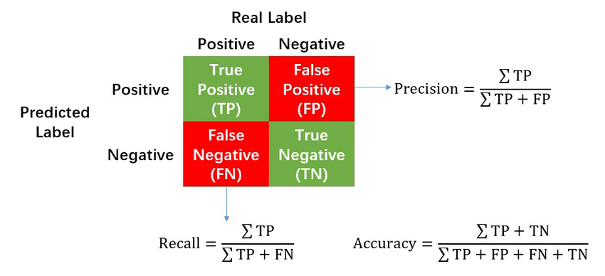
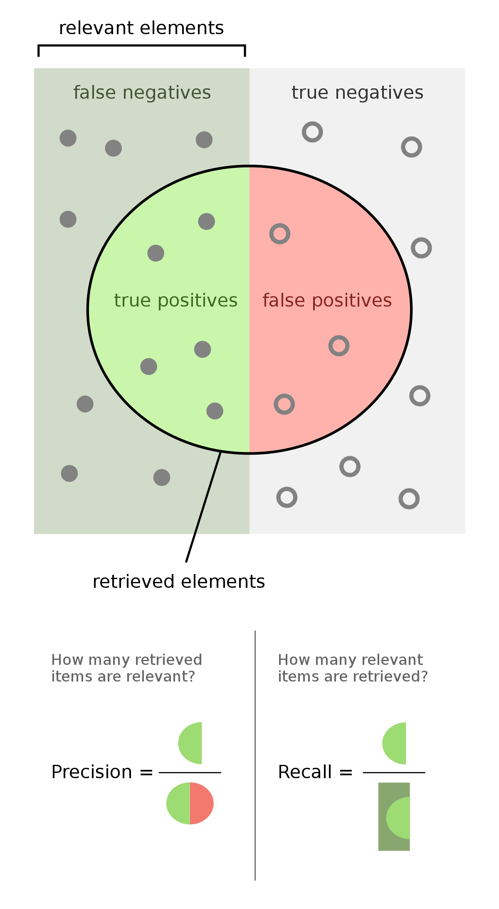

## 통계학

### 모수
- 통계적 모델링
  - 적절한 가정 위에서 확률 분포를 추정하는 것이 목표이며, 기계학습과 통계학이 공통적으로 추구하는 목표
  - 유한한 개수의 데이터만 관찰하여 모집단의 분포를 정확하게 알아내는 것은 불가능 $\rarr$ 근사적으로 확률 분포를 추정
- 모수적 방법론
  - 데이터가 특정 확률분포를 따른다고 선험적으로 가정한 후, 그 분포를 결정하는 모수를 추정하는 방법
- 비모수 방법론: 특정 확률 분포를 가정하지 않고 데이터에 따라 모델의 구조 및 모수의 개수가 유연하게 바뀌는 방법론
  - 기계학습에서 많이 사용하는 방법론
  - 모수가 없는 것이 아닌, 모수가 무한히 많거나, 모수가 바뀌는 것

#### 중심극한정리(Central limit theorem; CLT)
- 모집단의 형태와 관계없이 표본크기 n이 커질수록 $\overline{X}$의 분포(표집분포)는 정규분포에 근사

|분포에 따른 표집분포|
|:-:|
||

### 최대 가능도 추정
가장 가능성이 높은 모수를 추정하는 방법
- 표본 평균이나 표본 분산은 중요한 통계량이지만, 확률 분포마다 사용하는 모수가 다르므로 적절한 통계량에 영향을 미침
- 로그 가능도를 통해 계산의 연산량을 줄임으로써 최적화

#### 딥러닝에서의 최대가능도 추정법
- 딥러닝 모델의 가중치를 $\theta = (\bold{W^{(1)}}, \dotsb, \bold{W^{(L)}})$로 표기했을 때, 분류 문제에서 소프트맥스 벡터는 카테고리 분포의 모수 $(p_1, \dotsb, p_K)$를 모델링
- 원핫벡터로 표현한 정답레이블 $\bold{y} = (y_1, \dotsb, y_K)$을 관찰데이터로 이용해 확률분포인 소프트맥스 벡터의 로그 가능도의 최적화 가능
- $\theta_{MLE} = \displaystyle\argmax_\theta \frac{1}{n} \sum_{i=1}^n\sum_{k=1}^K y_{i, k} \log(MLP_\theta(\bold{x}_i)_k)$

#### 데이터 공간에 두 개의 확률 분포 $P(\bold{x}), Q(\bold{x})$가 존재할 경우
- 두 확률분포 사이의 거리를 계산하기 위한 함수
  - 총 변동 거리(Total Variation Distance; TV)
  - 쿨백-라이블러 발산(Kullback-Leibler Divergence; KL)
  - 바슈타인 거리(Wasserstein Distance)

### 베이즈 정리
조건부 확률을 이용하여 정보를 갱신하는 방법

- $P(\theta|D)$: 사후확률
- $P(\theta)$: 사전확률
- $P(D|\theta)$: 가능도
- $P(D)$: Evidence
- $P(\theta|D) = P(\theta) \frac{P(D|\theta)}{P(D)}$
---
조건부확률은 유용한 통계적 해석을 제공하지만, 인과관계를 추론할 때 사용해선 안된다.

> 인과관계: 데이터 분포의 변화에 강건한 예측 모형을 만들 때 필요

---
#### 베이즈 정리 예제
모 질병의 발병률이 10%로 알려져있다.  
해당 질병에 실제로 걸렸을 때 검진될 확률은 99%, 실제로 걸리지 않았을 때 오검진될 확률이 1%라고 할 때,  
어떤 사람이 질병에 걸렸다고 검진결과가 나왔을 때 실제로 감염되었을 확률은?

- 사전확률: 발병률(10%)
- 가능도
  - $P(D|\theta)$: 실제로 걸렸을 때 검진될 확률(99%)
  - $P(D|\tilde{\theta})$: 걸리지 않았을 때 오검진될 확률(1%)
- Evidence
  - $P(D) = \displaystyle \sum_{\theta} P(D|\theta)P(\theta) = 0.99 \times 0.1 + 0.01 \times 0.9 = 0.108$

$\therefore P(\theta|D) = 0.1 \times \frac{0.99}{0.108} \approx 0.916$
  

**오 검진률이 0.1로 상승할 시**
- $P(D) = \displaystyle \sum_{\theta} P(D|\theta)P(\theta) = 0.99 \times 0.1 + 0.1 \times 0.9 = 0.189$
- $\therefore P(\theta|D) = 0.1 \times \frac{0.99}{0.189} \approx 0.524$

$\rArr$ 오탐율 $\propto$ $\frac{1}{정밀도}$

---

#### 조건부 확률의 시각화

