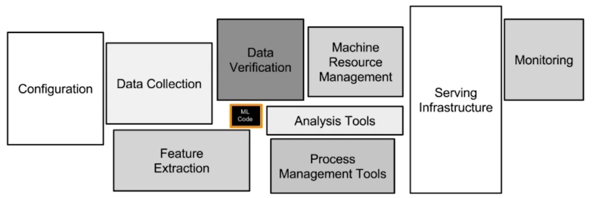

## MLOps 개론

### 모델 개발 프로세스 - Research
보통 자신의 컴퓨터, 서버 인스턴스 등에서 실행하며, 고정된 데이터를 통해 학습
1. 문제 정의
2. EDA
3. Feature Engineering
4. Train
5. Predict

### 모델 개발 프로세스 - Production
학습된 모델을 앱, 웹 서비스에서 사용할 수 있도록 만드는 과정이며 **Real World, Production 환경에 모델을 배포**한다고 표현
1. 문제 정의
2. EDA
3. Feature Engineering
4. Train
5. Predict
6. **Deploy**

---
모델이 배포되었다고 가정할 때, 모델의 결과값이 이상한 경우가 존재  
- Input 데이터가 범위를 벗어나는 이상한 경우가 존재하는 등 원인 파악 요구  
- Research 단계에선 Outlier로 제외할 수 있지만, 실제 서비스에선 제외가 힘들며, 별도 처리를 요구

모델 성능이 계속 변경
- 예측 값과 실제 레이블을 요구
- 정형(Tabular) 데이터에서는 정확히 알 수 있지만, 비정형 데이터는 모호한 경우가 다수

새로운 모델이 더 안좋다면
- 과거의 모델을 다시 사용할 지에 대한 판단 고려
- Research 환경에서 좋던 모델이 Production 환경에선 미흡할 수 있음
- 이전 모델을 다시 사용하기 위한 작업을 요구
---

### MLOps: ML(Machine Learning) + Ops(Operations)
- 머신러닝 모델을 운영하면서 반복적으로 필요한 업무를 자동화하는 과정
- 머신러닝 엔지니어링 + 데이터 엔지니어링 + 클라우드 + 인프라
- 머신러닝 모델 개발(ML Dev)과 머신러닝 모델 운영(Ops)에서 사용되는 문제와 반복을 최소화하고, 비즈니스 가치를 창출하는 것이 목표
- 모델링에 집중할 수 있도록 관련된 인프라를 만들고, 자동으로 운영되도록 만드는 일

*머신러닝 모델링 코드는 머신러닝 시스템 중 일부에 불과*

**MLOps의 목표**는 빠른시간 내에 가장 적은 위험을 부담하며 아이디어 단계부터 Production단계까지 ML프로젝트를 진행할 수 있도록 기술적 마찰을 줄이는 것

||Research ML|Production ML|
|:-:|:-:|:-:|
|**데이터**|고정|계속 변함(Dynamic-Shifting)|
|**중요 요소**|모델 성능(Accuracy, Loss 등)|모델 성능, 빠른 Inference 속도, 해석|
|**도전 과제**|더 좋은 성능을 내는 모델(SOTA), 새로운 구조의 모델|안정적인 운영, 전체 시스템 구조|
|**학습**|데이터를 고정한 채 모델 구조, 파라미터 기반 재학습|시간 흐름에 따라 데이터가 변경되어 재학습|
|**목적**|논문 출판|서비스에서 문제 해결|
|**표현**|Offline|Online|