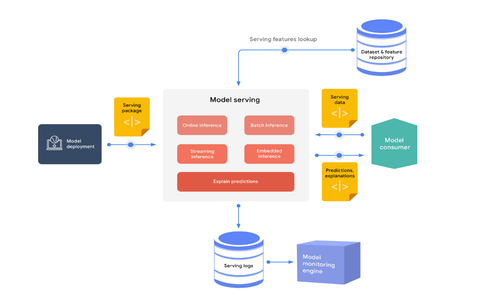
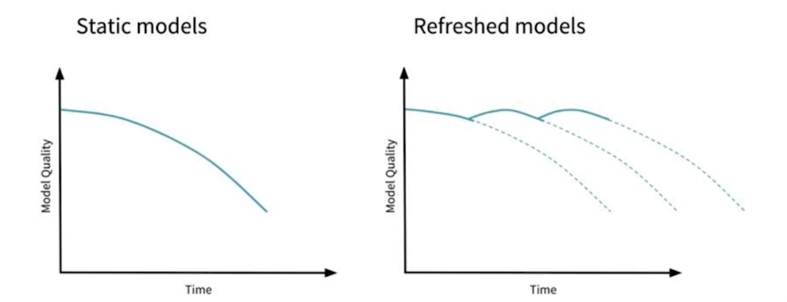
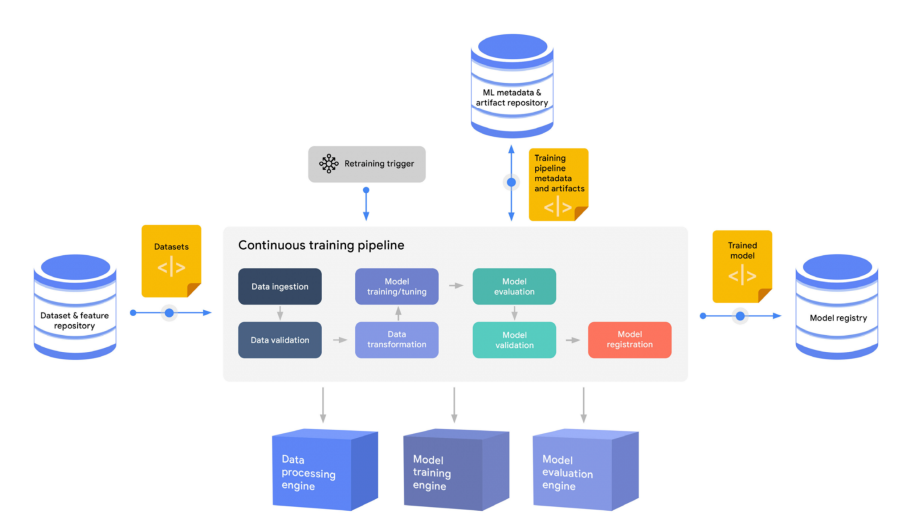

## MLOps Component
MLOps의 구성 요소에 따라 역할 분리

### Infra
배포하기 위한 성능 지표
- 클라우드
  - AWS, GCP, Azure, NCP 등
- 온프레미스
  - 회사나 대학원의 전산실에 서버를 직접 설치

#### Server Infra
- 예상하는 트래픽
- 서버의 CPU, Memory 성능
- 스케일 업, 스케일 아웃의 가능성
- 자체 서버 vs 클라우드

#### GPU Infra
- Local GPU vs Cloud GPU

### Serving
- Batch serving
  - 많은 양의 데이터를 일정 주기에 따라 예측
- Online serving
  - 한 번에 하나씩(실시간으로) 예측
  - 병목이 없으며, 확장 가능하도록 준비

### Experiment, Model Management
- 파라미터, 모델 구조 등의 조합에 따른 성능 지표를 관리
- 모델 Artifact, 이미지 등의 부산물 관리
- 모델 생성일, 성능, 모델의 메타 정보 등을 기록
- 여러 모델을 통일된 규격에 따라 운영 

### Feature Store
- 학습과 serving에 사용되는 모든 feature들을 모아둔 저장소
- 대용량 배치 처리와 low latency의 실시간 서빙을 모두 지원하여야 함

### Data Validation
- Feature의 분포 확인
- 데이터 검증에 실패하면 신규 모델의 배포를 중지하며, 해당 의사결정 역시 자동화로 진행
- Data/Model/Concept drift
  - 모델을 새로운 데이터에 맞게 꾸준히 학습하거나 목적 등을 전환하는 행위

### Continuous Training
- Retrain 과정
- 새로운 데이터를 사용하여 프로덕션 모델이 자동으로 학습
- 성능을 확인하여 학습 여부를 따지는 Pipeline이 Data Processing/Model training/Model evaluation engine에 영향을 미쳐 학습 진행

### Monitoring
- 모델의 지표, 인프라 성능 지표 등을 기록

### AutoML
- 데이터에 맞는 모델을 자동으로 제작