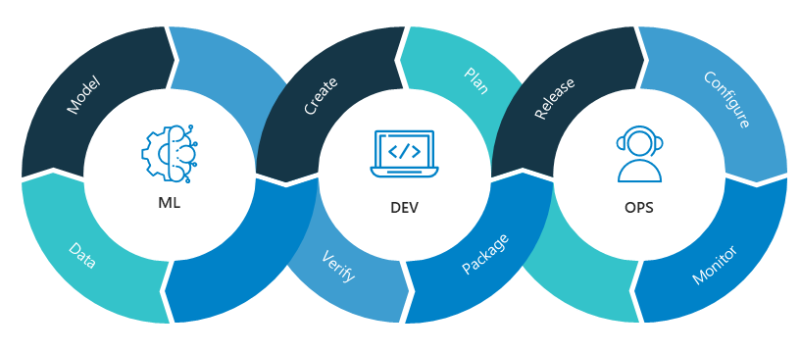
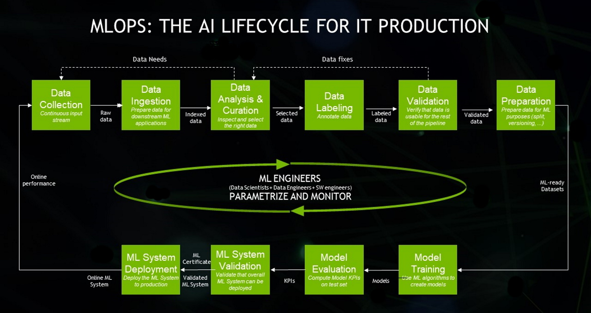

## ML 프로젝트 Lifecycle

### 문제 정의
특정 현상을 파악하고 그 현상에 있는 문제를 정의하는 과정
- 문제를 잘 풀기 위해서 문제 정의가 매우 중요
- 문제가 명확하지 않을 시 추후 과정에 장애 발생
  - 예시: 저는 **사람**들을 **행복**하게 만들고 싶어요
    - 모호한 문장
    - 대상 사람의 기준
    - 행복의 정의
- 머신러닝, AI, 데이터 사이언스, 개발 등 대부분 업무에서 항상 문제 정의가 선행되어야 함
- How보다 Why에 집중

#### 1. 현상파악
현상을 발견하여 상황을 파악하는 단계
- 어떤 일이 발생하는가?
- 해당 일에서 어려움은 무엇인가?
- 해당 일에서 해결하면 좋은 것은 무엇인가?
- 추가적으로 무엇을 해볼 수 있는가?
- 어떤 가설을 만들어 볼 수 있는가?
- 어떤 데이터가 있는가?

#### 2. 구체적인 문제 정의
앞선 현상을 더 구체적이고 명확한 용어로 정리
- 무엇을 해결하고 싶은가?
- 무엇을 알고 싶은가?
- 현상을 계속 쪼개서 그 문제를 기반으로 어떤 어려움을 겪는지 파악
- 데이터로 할 수 있는 일을 만들어서 진행하되, 알고리즘 접근이 최선은 아니므로 간단한 방법부터 점진적으로 접근하여 시간의 제약 완화
  - 원인을 계속 파고들면 해결 방법이 구체적으로 나올 수 있음

#### 3. 프로젝트 설계
문제 정의에 기반하여 프로젝트 설계
- 해결하고자 하는 문제 구체화
- 머신러닝 문제 타당성 확인
- 목표 설정, 지표 결정
  - 제약 조건
  - 베이스라인, 프로토타입
  - 평가(Evaluation) 방법 설계

#### 3-1. 머신러닝 문제 타당성 확인
머신러닝 문제를 고려하기 위해선 흥미가 아닌, 제품, 회사의 비즈니스에서 어떤 가치를 줄  수 있는지를 고려
- 머신러닝 문제
  - 결국 데이터로 부터 어떤 함수를 학습하는 것
  - 머신러닝 문제 타당성 평가
    - 복잡도를 평가하는 방법은 필요한 데이터의 종류와 기존 모델이 있는지 탐색
  - 모든 문제를 해결할 수 있는 도구가 아닌 것을 이해
  - 머신러닝으로 해결할 수 있는 문제지만 머신러닝 솔루션이 최적이 아닐 수도 있음
- 머신러닝을 이용하는 경우
  - 학습할 수 있는 패턴이 있는가?
  - 패턴이 복잡한가?
  - 학습을 위한 유용한 목적 함수가 정의될 수 있는가?
  - 학습을 위한 데이터가 존재하는가?
  - 사람이 반복적으로 실행하여야 하는가?
- 머신러닝을 이용하지 않는 경우
  - 비윤리적인 문제
  - 간단히 해결할 수 잇는 경우
  - 좋은 데이터를 얻기 어려운 경우
  - 한 번의 예측 오류가 치명적인 결과를 야기하는 경우
  - 시스템이 내리는 모든 결정이 설명 가능해야 할 경우
  - 비용이 효율적이지 않은 경우

#### 3-2. 목표 설정, 지표 결정
- 프로젝트의 목표
  - Goal: 프로젝트의 일반적으로 큰 목적
  - Objectives: 목적을 달성하기 위한 세부 목표
- 지표
  - 목표를 설정하며 데이터를 확인
  - 데이터 소스 탐색
  - 정확히 찾으려는 데이터가 없는 경우, 여러가지 시나리오를 고려
    - Label을 가진 데이터: 바로 사용
    - 유사 Label을 가진 데이터: 분석
    - Label이 없는 데이터: 직접 레이블링 하거나 레이블링 없는 상태에서 학습하는 방법 모색
    - 데이터가 아예 없는 경우: 데이터 수집 방법부터 고민
    - 데이터셋을 만드는 일은 반복적인 작업이므로, 이를 위해 Self-Supervised Learning 등을 사용하여 유사 레이블을 생성

#### 3-3 제약조건
- 일정: 프로젝트에 사용할 수 있는 시간
- 예산: 사용할 수 있는 최대 예산
- 관련된 사람: 이 프로젝트로 인해 영향을 받는 사람
- Privacy: Storage, 외부 솔루션, 클라우드 서비스 등에 대한 개인정보 보호 요구
- 기술적 제약: 기존에 운영하고 있던 환경, 레거시 환경(인프라)
- 윤리적 이슈: 윤리적으로 어긋난 결과
- 성능
  - Baseline: 새로 만든 모델의 비교 대상
  - Threshold: 확률 값의 기준
  - Performance Trade-off: 속도 vs 정확도
  - 해석 가능 여부: 결과 발생에 대한 해석 여부
  - Confidence Measurement: False Negative나 오탐에 대한 가능성

#### 3-4 베이스라인, 프로토타입
- Baseline
  - 자신이 모델이라고 생각하여 어떻게 분류할지 Rule base 규칙 설계
  - 간단한 모델부터 시작
    - 어떻게든 모델의 위험을 낮추는 것이 목표
    - 최악의 성능을 알기 위해 허수아비 모델로 시작
    - 점진적으로 향상
  - 유사한 문제를 해결하고 있는 SOTA 논문 파악
- 프로토타입
  - 베이스라인 이후, 간단한 모델에 대한 피드백
  - 동료들이 모델을 활용할 수 있는 환경 마련
  - 프로토타입 제공
    - Input을 입력하면 Output을 반환하는 페이지
    - 이왕이면 좋은 디자인을 가지면 좋지만, 모델의 동작이 더욱 중요
    - HTML 보다 모델에 집중
    - Voila, Streamlit, Gradio 등 활용

#### 3-5 Metric Evaluation
모델의 성능 지표와 별개로 비즈니스 목표에 영향을 파악
- RMSE와 같은 모델의 성능 지표
- 고객의 재방문율, 매출 등 비즈니스에 대한 지표
- Action이 기존보다 더 성과를 냈는지 파악

### 4. Action: 배포 & 모니터링
지표의 변화 파악
- 현재 만든 모델이 어떤 결과를 내고 있는가?
- 잘못 예측한다면 어떤 부분이 문제인가?
- 어떤 부분을 기반으로 예측하고 있는가?
- Feature의 어떤 값을 사용할 때 특히 잘못 예측하는가?

### 5. 추가 원인 분석
새롭게 발견한 상황을 파악해 어떤 방식으로 문제를 해결할 지 모색
- 앞서 진행한 과정을 반복