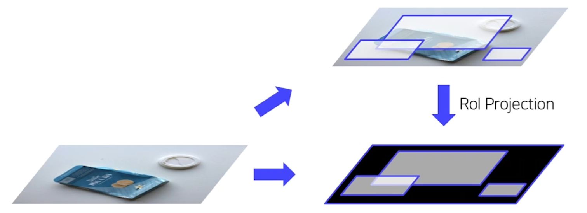
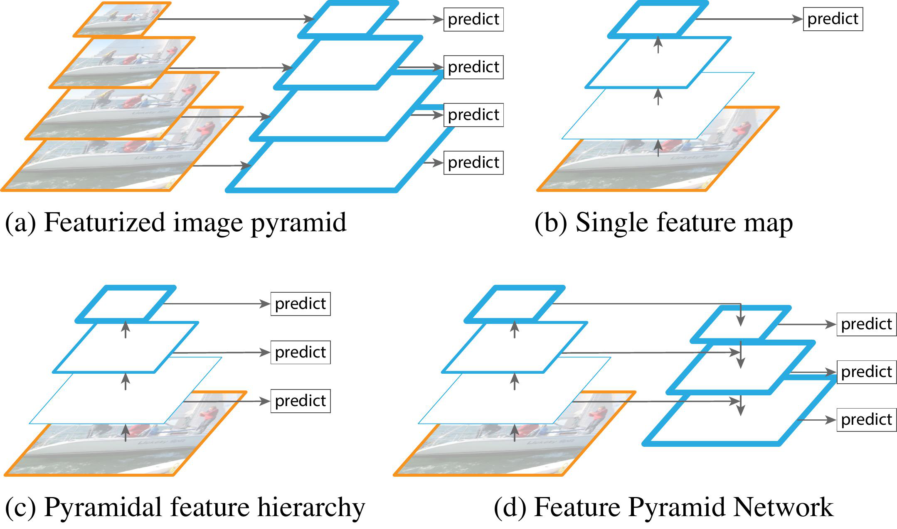
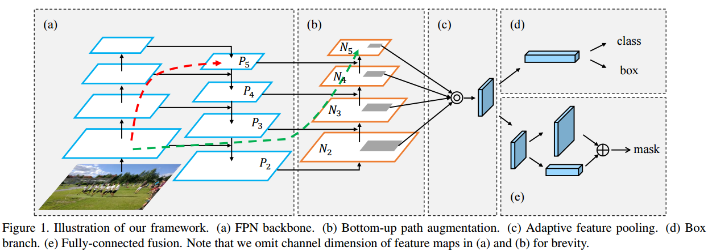

## 2 Stage Detectors

### Overview
#### Sliding Window
- 일종의 window로 입력 이미지를 스캔하여 후보 region으로 등록
- 수 많은 연산과 낮은 정확도 반환

#### Selective Search
- 이미지의 low-level 특성을 Segmentation하여 점차적으로 확장

### R-CNN
#### Pipeline
1. 입력 이미지 받기
2. Selective Search를 통해 약 2000개의 RoI(Region of Interest)를 추출
3. RoI의 크기를 조절해 모두 동일한 사이즈로 변경
    - CNN의 마지막 FC Layer의 입력 사이즈
4. RoI를 CNN에 넣어 feature 추출
    - 각 region마다 4096-dim feature vector 추출(2000*4096)
    - Pretrained AlexNet 구조 활용  
5. CNN을 통해 나온 feature를 SVM에 넣어 분류 진행
    - 클래스 개수가 C일 때 배경 여부까지 총 C+1개와 Confidence scores를 추출
6. CNN을 통해 나온 feature를 regression을 통해 bounding box 예측(RoI 미세 조정)

#### Training
- AlexNet
  - Domain specific finetuning
  - Dataset
    - IoU > 0.5: Positive samples
    - IoU <> 0.5: Negative samples
    - Batch
      - Positive samples: 32
      - Negative samples: 96
- Linear SVM
  - Dataset
    - Ground truth: Positive samples
    - IoU < 0.3: Negative samples
    - Batch
      - Positive samples: 32
      - Negative samples: 96
  - Hard Negative Mining
    - 배경으로 식별하기 어려운 샘플들을 강제로 다음 배치의 Negative sample로 Mining 하는 방법
    - Hard Negative: False Positive
- BBox Regressor
  - Dataset
    - IoUI > 0.6: Positive samples
  - Loss function
    - MSE Loss

#### 단점
- 2000개의 Region을 각각 CNN 통과
  - 연산량 상승 및 속도 저하
- 사이즈에 따른 강제 Warping
  - 성능 하락 우려
- CNN, SVM, BBox Regressor을 각각 따로 학습
- End-to-End가 아니므로 구조적 측면에서 한계 발생

### SPPNet
- 입력 이미지에 대해 Convolution 연산 
- Convolution 결과인 Feature vector에 대해 Spatial Pyramid Pooling 기법 수행
- Warping 과정 생략

#### Spatial Pyramid Pooling
[SPPNet 논문 리뷰](https://deep-learning-study.tistory.com/445)
- 여전히 단점 존재
  - CNN, SVM, BBox Regressor을 각각 따로 학습
  - End-to-End가 아니므로 구조적 측면에서 한계 발생

### Fast R-CNN
1. CNN에 넣어 Feature 추출
2. RoI Projection을 통해 feature map 상에서 RoI를 계산
3. RoI Pooling을 통해 일정한 크기의 feature 추출
   - 고정된 vector 확보
   - SPP 사용
     - Pyramid level: 1
     - Target grid size: 7*7
4. Softmax 및 BBox Regressor
   - 클래스 개수: C+1개 (배경 포함)
   - Multi-task Loss
     - Classification: Cross entropy
     - BBox Regressor: Smooth L1
   - Dataset
    - IoU > 0.5: Positive samples
    - 0.1 < IoU < 0.5: Negative samples
    - Postitive samples: 25%
    - Negative samples: 75%
5. Train
   - Hierarchical Sampling
     - R-CNN
       - 이미지에 존재하는 RoI를 전부 저장하여 사용
       - 한 배치에 서로 다른 이미지의 RoI가 포함
     - Fast R-CNN
       - 한 배치에 한 이미지의 RoI만을 포함
       - 배치 안에서 연산과 메모리를 공유
6. 단점
    - Selective search는 학습 개념이 아니므로 End-to-End를 완전히 해결하지 못한 학습

### Faster R-CNN
#### Pipeline
1. 이미지를 CNN 한 번만 이용하여 feature maps 추출
2. RPN을 통해 RoI 계산
  - 기존의 Selective Search 대체
  - Anchor Box 개념 사용
    - 각 셀마다 비율을 다르게 두어 각 셀마다 N개의 Anchor box를 미리 정의
    - 객체의 크기에 대응 가능
  - RPN - [외부 블로그 참고](https://herbwood.tistory.com/10)
     1. CNN에서 나온 feature map을 input으로 입력
     2. 3*3 conv를 수행하여 intermediate layer 생성
        1. 1*1 conv를 수행하여 Binary Classification 수행: (Object or Not = 2) * (Num of Anchors = 9)
        2. 1*1 conv를 수행하여 BBox Regression 수행: (Bounding box = 4) * (Number of Anchors = 9)
  - NMS
    - 유사한 RPN Proposals를 제거하기 위해 사용
    - Class score을 기준으로 proposals 분류
    - IoU가 0.7 이상인 proposals 영역들은 중복된 영역으로 판단한 뒤 제거

#### Training
- RPN
  - RPN 단계에서 Classification과 Regressor 학습을 위해 Anchor box를 Positive/Negative samples 구분
  - 데이터셋
    - IoU > 0.7 or highest IoU with GT: Positive samples
    - IoU < 0.3: Negative samples
    - Otherwise: 학습에서 배제
  - Loss
    - Multi-Task Loss (Classification + Regression)
- Fast R-CNN
  - 데이터셋
    - IoU > 0.5: Positive samples (32개)
    - IoU < 0.5: Negative samples (96개)
    - 128개의 samples로 mini-batch 구성
  - Loss
    - Fast R-CNN과 동일
- RPN & Fast RCNN
  - Step
    1. RPN 학습: Imagenet pretrained backbone 호출
    2. Fast RCNN 학습: Imagenet pretrained backbone 호출 + Step 1의 RPN
    3. RPN 재학습: Step2의 finetuned backbone(Freeze)
    4. Fast RCNN 재학습: Step2의 finetuned backbone(Freeze) + Step3의 RPN
  - 위의 스텝이 매우 복잡하여 최근에는 Approximate Joint Training 활용
    - Loss를 한 번에 묶어서 Backward 수행

### Neck
Low Level의 feature는 Semantic이 약하고, High Level의 feature는 Localization이 약하므로 다양한 크기의 객체를 더욱 잘 탐지하기 위해 Feature Level끼리 교환하는 기법
- FPN
- PANet

### FPN(Feature Pyramid Network)
- Pyramidal feature hierarchy: 각 Layer의 Feature를 통해 예측
- Feature Pyramid Network: 각 Layer의 Feature에서 예측한 후 문맥 교환 제공
  - Top-down Path way: Pyramid 구조를 통해서 High Level의 정보를 Low Level에 순차적으로 전달

#### Scoring
- 각 Feature Map을 각각의 RPN에 입력하여 개별적인 class score과 BBox regressor을 출력
  - Input: Multi-scale feature map
  - Process: Region proposal and Non Maximum Suppression(NMS)
  - Output: 1000 region proposals
- region proposals를 어떤 scale의 feature map과 매칭할 지 기억
  - $k=[k_0 + log_2(\sqrt{wh}/224)]$
  - $\therefore w, h \propto 1/k$
  - 아래 그림에서 $k_0 = 4$
  - $w, h$가 크면 클수록 Low Level의 Feature map

#### 결론
- 여러 scale의 물체를 탐지하기 위해 설계
- 여러 크기의 Feature를 사용
- Bottom up(backbone)에서 다양한 크기의 Feature map을 추출하고, Feature map의 Semantic을 교환하기 위해 Top-down 방식 사용

### PANet(Path Aggregation Network)
다수의 CNN 레이어를 갖는 모델에서 Low-Level Feature까지 정보가 전달되지 않는 한계를 개선
- Adaptive Feature Pooling
  - $k=[k_0 + log_2(\sqrt{wh}/224)]$ 수식이 wh에 따라 Feature map을 선택하므로 다른 결과를 유도할 수 있는 우려 발생
  - 모든 Feature map에서 RoI Projection를 진행하여 Channel에 대한 Max Pooling하여 최종 Feature map 생성
- 문맥 교환 추가
  - Bottom-up Path way: Top-down Path way를 진행 후 다시 Low Level의 Feature를 High Level에도 전달
  
