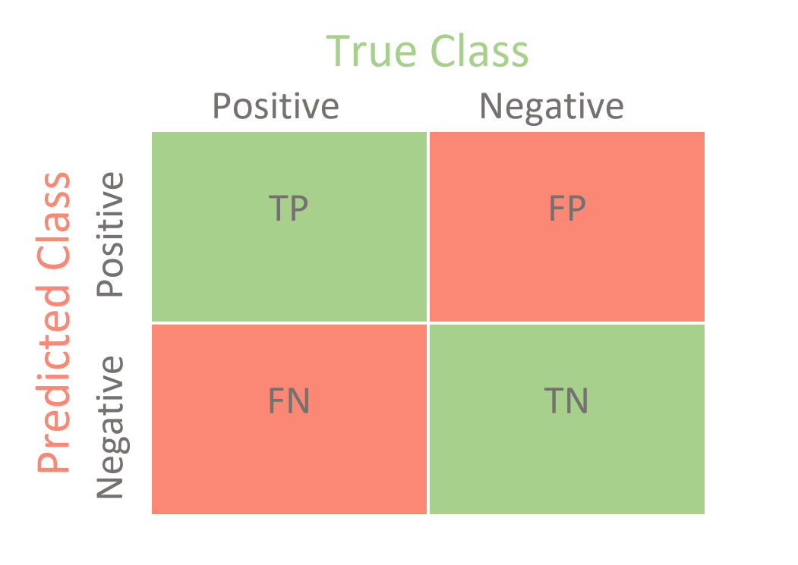
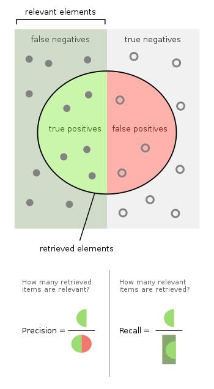
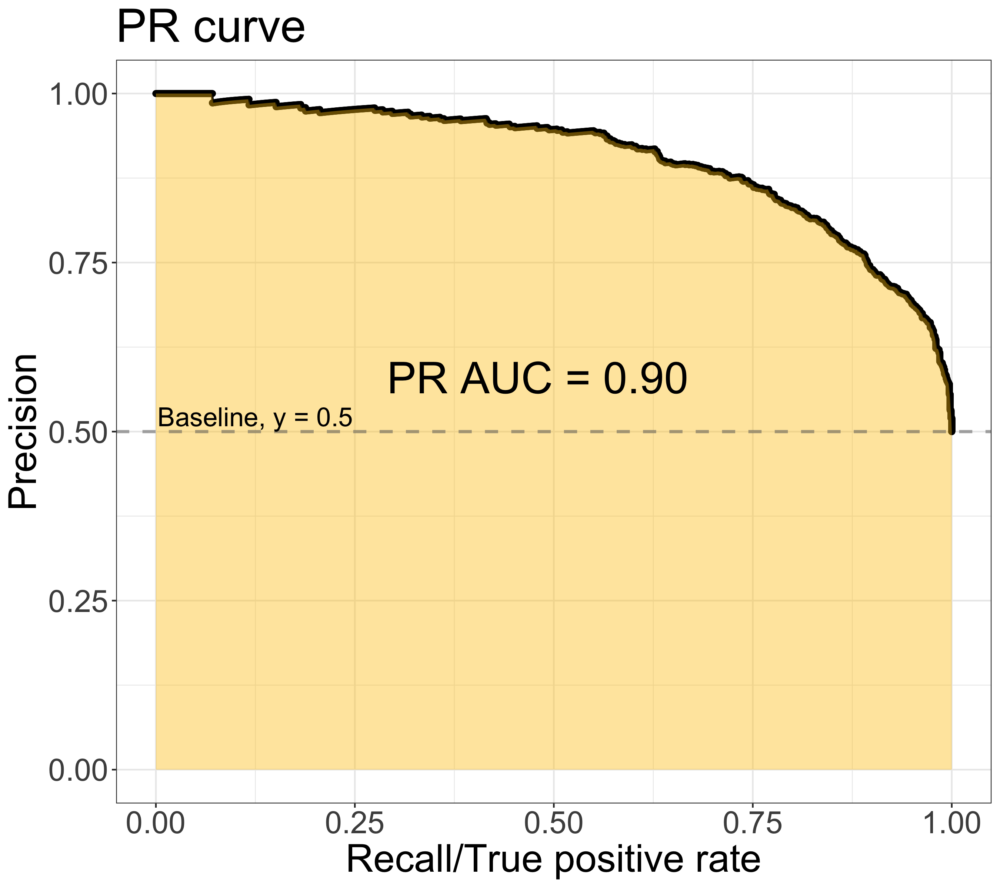

## Object Detection Basic
이미지 내에서 객체를 식별하는 Task

### Segmentation
- Semantic Segmentation
  - 서로 다른 영역을 구분
  - 같은 class에 대해서 구분하지 않는 작업
- Instance Segmentation
  - 객체의 영역을 구분
  - 같은 class를 분리하여 식별하는 작업

### Real world
- 자율주행
- OCR
- 스마트 팜
- 흉부 X-ray 이상 탐지

### Evaluation Metric

#### 성능
- Confusion matrix
  - True / False: 정답 Label의 여부
  - Positive / Negative: 예측 Label의 여부
  - True Positive(TP): 검출 되어야할 것이 검출
  - True Negative(TN): 검출되지 말아야할 것이 검출되지 않음
  - False Positive(FP): 검출되지 말아야할 것이 검출됨
  - False Negative(FN): 검출되어야 할 것이 검출되지 않음

- Precision
  - $Precision = \frac{TP}{TP + FP} = \frac{TP}{All-Detections}$
  - 모든 예측에 대한 Positive의 비율
- Recall
  - $Recall = \frac{TP}{TP + FN} = \frac{TP}{All\ Ground\ Truths}$
  - 모든 정답 Label들에 대한 예측 비율

- PR Curve
  - Ground Truth가 10개라고 가정
  - 예측한 n(=10)개의 레이블을 Confidence 기준 내림차순으로 정렬
  - 아래 표의 Precision과 Recall에 대한 그래프를 의미
  - $AP =$ 그래프 아랫 면적

<table>
    <th colspan=8>
예제
</th>
    <tr><td></td><td>Category</td><td>Confidence</td><td>TP/FP</td><td>누적 TP</td><td>누적 FP</td><td>Precision</td><td>Recall</td></tr>
    <tr><td>1</td><td>Plastic</td><td>95%</td><td>TP</td><td>1</td><td>-</td><td>1/1 = 1</td><td>1/10 = 0.1</td></tr>
    <tr><td>2</td><td>Plastic</td><td>90%</td><td>TP</td><td>2</td><td>-</td><td>2/2 = 1</td><td>2/10 = 0.2</td></tr>
    <tr><td>3</td><td>Plastic</td><td>82%</td><td>FP</td><td>2</td><td>-</td><td>2/3 = 0.67</td><td>2/10 = 0.2</td></tr>
    <tr><td>4</td><td>Plastic</td><td>80%</td><td>TP</td><td>3</td><td>-</td><td>3/4 = 0.75</td><td>3/10 = 0.3</td></tr>
    <tr><td>5</td><td>Plastic</td><td>72%</td><td>TP</td><td>4</td><td>-</td><td>4/5 = 0.8</td><td>4/10 = 0.4</td></tr>
    <tr><td>6</td><td>Plastic</td><td>70%</td><td>FP</td><td>4</td><td>-</td><td>4/6 = 0.67</td><td>4/10 = 0.4</td></tr>
    <tr><td>7</td><td>Plastic</td><td>60%</td><td>TP</td><td>5</td><td>-</td><td>5/7 = 0.71</td><td>5/10 = 0.5</td></tr>
    <tr><td>8</td><td>Plastic</td><td>41%</td><td>FP</td><td>5</td><td>-</td><td>5/8 = 0.63</td><td>5/10 = 0.5</td></tr>
    <tr><td>9</td><td>Plastic</td><td>32%</td><td>FP</td><td>5</td><td>-</td><td>5/9 = 0.56</td><td>5/10 = 0.5</td></tr>
    <tr><td>10</td><td>Plastic</td><td>10%</td><td>TP</td><td>6</td><td>-</td><td>6/10 = 0.6</td><td>6/10 = 0.6</td></tr>
</table>

- IoU(Intersection over Union)
  - Ground truth 영역과 predict 영역이 겹친 정도 혹은 비율
  - $IoU = \frac{overlapping\ region}{combined\ region}$

#### 속도
- FPS(Frames per Second)
  - 초당 처리 속도
  - 성능에 비례
- FLOPs(Floating Point Operations)
  - 연산량 횟수(곱하기, 더하기, 빼기 등)
  - $Convolution\ layer\ Flops = C_{in} * C_{out} * K * K * H_{out} * W_{out}$

### Library
#### MM Detection
- Pytorch 기반 Object detection 오픈소스

#### Detectron2
- 페이스북 AI 리서치의 라이브러리
- Pytorch 기반의 Object detection/segmentation 알고리즘 제공

#### YOLOv5
- COCO 데이터셋으로 사전 학습된 모델
- 수천 시간의 연구와 개발에 걸쳐 발전된 Object detction 모델
- Colab, Kaggle, Docker, AWS, GCP 등에서 오픈소스 제공

#### EfficientDet
- Google Research & Brain에서 연구한 모델
- EfficientNet을 응용하여 만든 Object detection 모델
- Tensorflow로 제공
- Github에 Pytorch 기반으로 구현된 라이브러리 존재