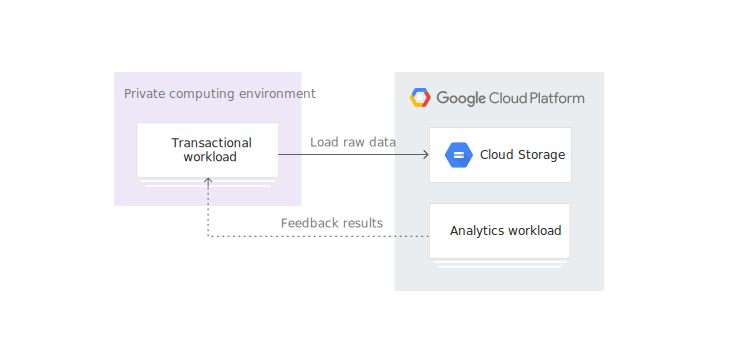

## 온프레미스와 클라우드
### 온프레미스(On-premises)
- 데이터 센터나 서버실에 서버를 두고 직접 관리하는 방식
- 개인적인 NAS나 서브 PC로 구동하는 작은 서버 포함
- 서버, 네트워크 장비, OS, 스토리지, 각종 솔루션 등을 직접 사서 설치하고 관리
- 장비들은 상당히 고가이기 때문에 초기 투자 비용이 크고 이후 사용 예측량을 가늠하기가 힘들며 한번 구축해놓으면 사용량이 적어도 높은 유지 비용을 요구
- Private Cloud도 On-Premises에 속하지만, Private Cloud는 가상화 클라우드 관리 스택이 존재

> 항상 클라우드가 좋은 것은 아닙니다. 무조건 클라우드가 좋으니까 옮기자!가 아니라 상황에 온프레미스가 맞는 경우도 있으니 제대로 검토해야 합니다.

> 온프레미스와 클라우드는 모두 가용성을 보장합니다만 개념에서 차이가 있습니다. *온프레미스는 서버가 죽지 않는 것을 목표*로 합니다. 반면 **클라우드는 많은 인스턴스로 이루어진 분산 환경에서 인스턴스가 죽으면 다른 인스턴스가 빠르게 대체**하는 것을 의미합니다. 즉 그냥 클라우드를 사용한다고 해서 가용성이 보장되는 것이 아니라, **가용성을 높이도록 직접 설계**해야 합니다. 따라서 *잠시라도 끊어져서는 안되는 시스템이나 클라우드 업체가 보장하는 것 이상의 가용성이 필요한 시스템에서는 온프레미스가 유리*합니다.

> 기밀성이 높은 데이터의 경우에도 온프레미스가 유리합니다. 물론 자사의 보안보다 클라우드 프로바이더가 제공하는 보안이 더 좋을 수 있습니다만 *물리적인 저장 장소를 명확히 알 필요가 있을 때는 온프레미스가 유리*합니다. 또한 멀티 클라우드를 사용한다면 각 클라우드 프로바이더마다 보안 정책이 다르기 때문에 보안 표준을 구축하기 어렵습니다.

> 이 외에도 특정 유료 솔루션을 사용하는 경우나 클라우드가 지원하지 않는 특수한 플랫폼을 사용하는 경우에는 클라우드를 이용할 수가 없습니다.

### 클라우드(Cloud)
|구분|퍼블릭 클라우드(Public Cloud)|프라이빗 클라우드(Private Cloud)|
|:-:|:-:|:-:|
|**서비스 대상**|한정된 그룹|불특정 다수|
|**인프라 위치**|자체 데이터센터|CSP 데이터 센터|
|**인프라 운영**|사내 엔지니어|CSP 엔지니어|
|**장점**|기업이 원하는 대로 구축 및 운영 가능|- 초기 구축 비용 저렴(사용한 만큼 지불)<br>- 인프라 환경 운영에 대한 부담 저하<br>-트래픽에 대한 빠른 대응<br>- 다양한 Paas, Saas등의 상품을 이용한 빠른 개발
|||

```
CSP(Cloud Solution Provider): 공공 클라우드 인프라, 플랫폼 서비스를 제공하는 업체를 의미
PaaS(Platform as a service): 서비스형 플랫폼으로써, 주로 응용 프로그램을 개발할 때 필요한 플랫폼을 제공
SaaS(Software as a service): 서비스형 소프트웨어, 사용자에게 제공되는 소프트웨어를 가상화하여 제공

IaaS(Infrastructure as a service): 서비스형 인프라로써, 확장성이 높고 자동화된 컴퓨팅 리소스를 가상화하여 제공(원하는 사양의 가상 머신이나 스토리지를 선택하고 이용한 시간이나 데이터 양에 따라 비용을 지불)
AIaaS(AI as a service): 서비스형 인공지능으로써, 다양한 AI 기반 기능을 포함하여 타사 공급업체가 고객사에 서비스 형태로 제공하는 인공지능 소프트웨어(즉시 사용할 수 있는 AI 제품)
```

>회사 직원용 시스템(근태 관리, 회계, 인사 등)은 사용자가 한정되어 있고 트래픽을 예측하기가 쉬워 온프레미스도 큰 문제가 없습니다. 하지만 **대외 서비스의 경우 트래픽을 예상하기가 쉽지 않습니다.** 이렇게 트래픽 양에 따라 서버 사양이나 네트워크 대역을 가늠하는 것을 **사이징(sizing)** 이라고 하는데 상당히 어려운 작업입니다. 크게 잡으면 낭비가 되고 적게 잡으면 단기간에 증설하기가 어렵기 때문입니다. 이렇게 **트래픽의 변동이 많은 시스템은 클라우드 시스템이 유리**합니다. 클라우드 시스템에서는 트래픽에 따라 자동으로 증설해주는 **오토스케일링(Auto Scaling)** 이 있어 유리합니다.


### 하이브리드 클라우드(Hybrid cloud)


- 각 시스템의 특성에 맞게 온프레미스와 클라우드를 함께 사용하기도 함
- 클라우드 프로바이더 역시 각자의 장점이 달라서 여러 클라우드를 함께 사용하기도 함
- 이를 결정하기 위해 특성을 잘 파악하고 선택의 기준이 명확해야 함

### 멀티 클라우드(Multi Cloud)
- 다른 CSP의 Public Cloud를 결합한 형태