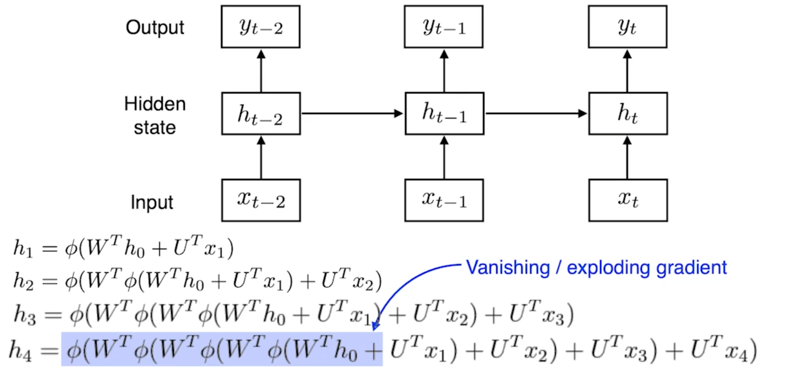

## Recurrent Neural Networks(RNN)

### Autoregressive model
과거의 Time span을 고정하는 기법으로, AR(n)일 시, 과거 n 스텝에 의존

#### Markov model
직전 스텝의 과거에 의존하는 기법
- 이때 껏의 많은 정보를 포기

#### Latent autoregressive model
과거 정보를 요약하는 Hidden State를 형성

### RNN; Vanila RNN
Short-term dependencies
- Hidden State를 보유하여 과거를 기억하는 노드 형성
- 멀리 있는 기억 노드에 대해서 점차 잊게 되는 한계보유
- Gradient Vanishing/Exploding 현상 발생

|RNN 구조|Gradient Vanishing/Exploding|
|:-:|:-:|
|||

### Long Short Term Memory(LSTM)
3개의 입력을 받아 과거의 정보 유실 정도를 결정
- 입력(출력)
  - Input(Output): 현재 노드의 입력(출력)
  - Previous(Next) cell state: 이전(현재)까지의 노드 정보를 취합하여 요약
  - Previous(Next) hidden state: 이전(현재) 노드의 output
- 출력
  - Output
  - Next cell state
  - Next hidden state
- Gate
  - Forget gate: 정보의 유용함을 판단하여 현재까지의 정보(Cell state) 중 버릴 정보를 조정
  - Input gate: 현재 정보에서 Cell state에 등록할 정보를 선택
  - Output gate: 최종적으로 조작하여 다음 노드로 전달할 정보를 정리

### GRU
LSTM 구조에서 Gate를 2개로 줄여 구조적 단순함 식별
