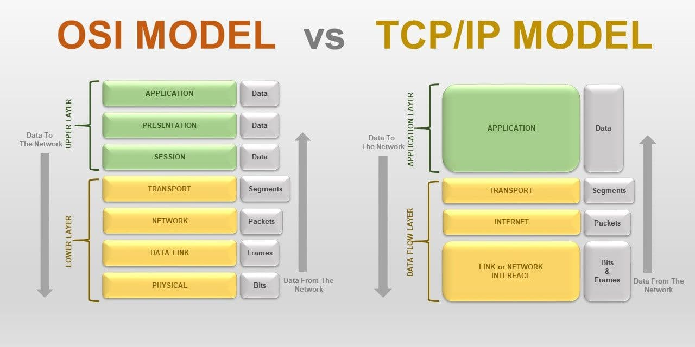

## OSI 모델

### OSI 모델
국제 표준화 기구(International Organization for Standardization; IOS)에서 만든 컴퓨터의 통신 기능을 계층 구조로 나눈 모델
- 네트워크 계층을 시각화하여 특정 네트워킹 시스템에서 일어나는 일에 대해 이해 가능
- 총 7계층으로 구성
- 데이터가 네트워크로 진입할때는 위층에서 진입
- 네트워크에서 데이터를 수신할 때는 아래층에서 진입

> 프로토콜: 컴퓨터 내부에서, 또는 컴퓨터 사이에서 데이터의 교환 방식(언어, 방법 등)을 정의하는 규칙 체계

#### 1. 물리 계층(Physical Layer)
- 전송 케이블이 직접 연결되는 계층(케이블을 통해 전송하는 기능)
- 전압과 전류의 값을 할당하거나 케이블, 커넥터의 모양 등 통신 장비의 물리적 전기적 특성을 규정
- Ex) LAN 케이블로 사용되는 트웨스트 페어 케이블(STP/UTP)이나 이더넷(Ethernet) 규격인 100BASE-T 또는 IEEE802.11 시리즈의 무선 통신 등

#### 2. 데이터 링크 계층(Data Link Layer)
- 동일한 네트워크에서 인접한 두 시스템(노드) 간의 통신을 규정
- 물리 계층이 잘 동작하는지 확인하는 역할
- MAC 주소를 기반으로 동작
- 네트워크 계층에서 데이터 패킷을 받아들여 MAC 주소와 각종 제어 정보를 추가
- 데이터 단위: 프레임(frame)

> L2 스위치 장비: 데이터 링크 계층에서 동작하며, 통신하고 싶은 노드가 어떤 포트와 연결되어 있는지를 MAC 주소로 판단하고 패킷을 전송하는 장비

#### 3. 네트워크 계층(Network Layer)
- 서로 다른 네트워크 간 통신을 위한 규정
- 특정 서버로 가능 경로를 효율적으로 처리하는 라우팅(routing) 기능 존재
- IP 주소를 기반으로 동작
- 송신지에서 최종 수신지까지 데이터를 안전하게 전달하는 역할
- 제어 기법 제공
  - 흐름 제어: 수신자가 혀용할 수 있는 만큼의 데이터만 보내도록 패킷 양 조절
  - 오류 제어: 전송 중 분실되는 패킷을 감지하고 재전송을 요구
  - 혼잡 제어: 인터넷 공간에 너무 많은 데이터그램이 존재하거나, 데이터그램이 처리 성능을 넘어서는 것을 방지
- 데이터 단위: 패킷(packet)

> 데이터그램: IP의 전송 단위  
> L3 스위치 or 라우터: 컴퓨터 네트워크 간에 데이터 패킷을 전송하는 네트워크 장치  
> 라우팅: 네트워크에서 경로를 선택하는 프로세스  

#### 4. 전송계층(Transport Layer)
- 데이터 전송을 제어
- 데이터의 용량, 속도, 목적지 등을 처리
- 데이터 전송: 세션 계층에서 보낸 메시지를 세그먼트로 나누고 각 세그먼트의 순서 번호를 기록하여 네트워크 계층으로 전달
- 데이터 수신: 세그먼트를 조립하여 전송 오류의 검출이나 재전송을 규정
- 대표 프로토콜: TCP, UDP

#### 5. 세션 계층(Session Layer)
- 애플리케이션 간 연결을 유지 및 해제하는 역할
- 커넥션 확립 타이밍이나 데이터 전송 타이밍 등을 규정

#### 6. 프레젠테이션 계층(Presentation Layer)
- 데이터를 애플리케이션이 이해할 수 있도록 변환
- 데이터의 저장 형식, 압축, 문자 인코딩 등을 변환
- 데이터를 안전하게 전송하기 위해 암호화, 복호화 처리

#### 7. 응용 계층(Application Layer)
- 최상위 계층
- 웹 브라우저 등 사용자가 직접 사용하는 애플리케이션