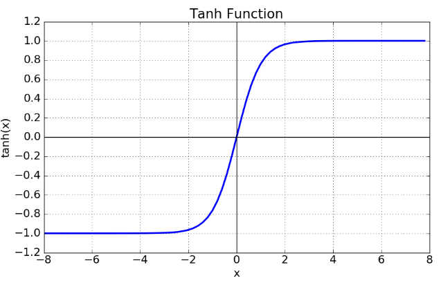
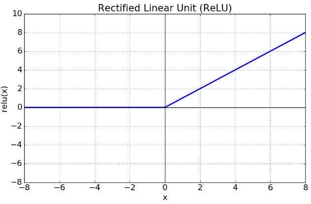

## 신경망

### 소프트맥스(Softmax) 연산
모델의 출력을 확률로 해석할 수 있게 변환해주는 연산
- 분류 문제를 풀 때 선형 모델과 소프트맥스 연산을 결합하여 예측

#### One-Hot
최대값을 가진 주소만 1로 출력하는 연산을 사용하며, 추론을 할때 주로 사용

### 활성함수
$\R$ 위에 정의된 비선형(nonlinear) 함수
- 딥러닝에서 ReLU 함수를 주로 이용

|Sigmoid|tanh|ReLU|
|:-:|:-:|:-:|
||||

### 신경망(Neural Network)
데이터를 비선형으로 해석하는 모델
- 활성함수를 쓰지 않으면 선형 모형과 동일
- 선형 모델과 활성함수(activation function)를 합성한 함수
- 단층 신경망
  - $\bold{O} = \bold{WX + B}$
- 다층 신경망
  - $\sigma$: 활성함수
  - $z$: 잠재벡터 (충 별 Output 벡터)
  - $H$: 활성함수를 통과한 잠재벡터
  - $\bold{z} = \bold{W^{(t)}x + b^{(t)}}$
  - $\bold{H} = (\sigma(z_1), \dotsb, \sigma(z_n))$
  - $\bold{O = HW^{(L)} + b^{(L)}}$
#### 순전파
1층부터 L층 까지의 순차적인 신경망 계산

---
**층을 여러개 쌓는 이유**
universal approximation theorem 이론에 따라 2층 신경망으로도 임의의 연속함수를 근사할 수 있지만, 실제로는 무리가 있다.  
층이 깊을수록 목적함수를 근사하는데 필요한 뉴런(노드)의 숫자가 훨씬 빨리 줄어들어 더욱 효율적으로 학습이 가능하다.  

층이 얇으면 필요한 뉴런의 숫자가 기하급수적으로 늘ㅇ나므로 넓은 신경망이 되어야한다.

---