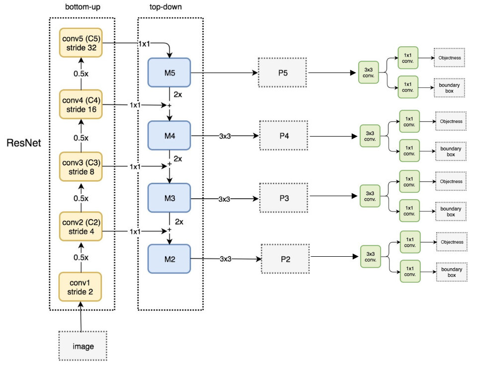

## Neck
Low Level의 feature는 Semantic이 약하고, High Level의 feature는 Localization이 약하므로 다양한 크기의 객체를 더욱 잘 탐지하기 위해 Feature Level끼리 교환하는 기법

### FPN(Feature Pyramid Network)
- Pyramidal feature hierarchy: 각 Layer의 Feature를 통해 예측
- Feature Pyramid Network: 각 Layer의 Feature에서 예측한 후 문맥 교환 제공
  - Top-down Path way: Pyramid 구조를 통해서 High Level의 정보를 Low Level에 순차적으로 전달

#### Scoring
- 각 Feature Map을 각각의 RPN에 입력하여 개별적인 class score과 BBox regressor을 출력
  - Input: Multi-scale feature map
  - Process: Region proposal and Non Maximum Suppression(NMS)
  - Output: 1000 region proposals
- region proposals를 어떤 scale의 feature map과 매칭할 지 기억
  - $k=[k_0 + log_2(\sqrt{wh}/224)]$
  - $\therefore w, h \propto 1/k$
  - 아래 그림에서 $k_0 = 4$
  - $w, h$가 크면 클수록 Low Level의 Feature map

#### 결론
- 여러 scale의 물체를 탐지하기 위해 설계
- 여러 크기의 Feature를 사용
- Bottom up(backbone)에서 다양한 크기의 Feature map을 추출하고, Feature map의 Semantic을 교환하기 위해 Top-down 방식 사용