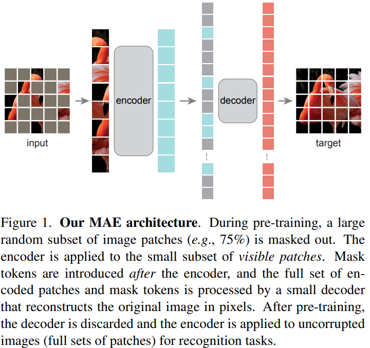

# Masked Auto-Encoder (MAE)

### keywords
- patch / token: (이미지) 파편
- 잠재 변수(Latent representations): 특정 데이터를 가장 잘 설명할 수 있는 값

### 요약
> MAE is Scalable **Self-supervised learners**.  
> MAE의 Concept는 패치를 랜덤으로 Masking하고, Masking된 Missing Pixels를 재 구성 하는 것이다.  
> MAE의 Design은 다음 두 가지를 따르며, 무거운 모델에 대한 efficiently and effectively하게 학습이 가능하다.
> 
> 1. 비대칭 Encoder-Decoder 구조이다.  
> Encoder는 without Mask patches에 대해서 동작하며, Decoder는 latent representations와 mask patches를 통해 원본 이미지를 재구성한다.  
> 2. 75%와 같은 매우 큰 영역에 대해 마스킹을 처리하게 될 시 의미있는 supervisory task를 반환할 것으로 예상한다.
>
> 해당 Design은 3배 이상의 속도와 함께 정확도 향상을 도출한다.
> 

## 초록
**NLP 모델의 Solutions**: 데이터의 일부를 제거하고, 제거된 영역을 예측
- GPT
  - Auto Regressive
- BERT
  - Masked Auto-Encoding

*대략 1000억개의 Parameter를 소비*  

### NLP vs Vision
1. 아키텍쳐가 다르다.
   - Vision은 CNN이 압도적으로 널리 활용
   - Masked patch이나 Positional embedding 같은 ```indicators```를 결합하는 데에 장애
     - ViT에서 다룸으로써 어느정도 해결
2. 정보 밀집도가 다르다
   - 언어: 인간이 만들어낸 일종의 신호로, 매우 큰 정보를 포함
     - 문장에서 Masking 후 예측 할 때 ```Sophisticated languages understanding```을 유도
   - 이미지: 공간적 중복성(정보)을 보유한 자연 신호
     - 패치가 없어져도 주변 패치의 parts, objects, scenes를 high-level로 이해하여 회복 가능
     - 차이를 극복하기 위해 이미지의 매우 많은 영역을 랜덤으로 Masking
3. Decoder
   - 언어의 Decoder는 찾아 낼 Missing Words의 Semantic이 풍부
   - *BERT의 Decoder는 MLP로 보잘 것 없다!*
   - 이미지 Decoder는 Pixel을 형성하므로 Recognition Task에 비해 낮은 Semantic을 보유
   - 이미지의 Decoder은 학습된 잠재 변수의 Semantic level을 결정

### MAE
Random patch에 대해 마스킹 후 재구성
- Encoder와 Decoder가 비대칭 구조
- Win-Win Scenario
  1. 인코더는 데이터의 25%만을 이용해서 최적화
  2. 전반적으로 3배 이상의 시간과 메모리를 절약
- ```ViT-Huge```: 87.8%(ImageNet 1K)

## 관련 연구
**Bert & GPT**: Masked language model

**Auto Encoder**: Representations를 학습하는 가장 classic한 방법
- Encoder: Input을 latent representations으로 맵핑
- Decoder: latent representations로 부터 Input을 재구성
- Ex) PCA, K-means

**Denoising Auto Encoder(DAE)**
- ```Auto encoder```의 일종
- Input signal을 오염시킨 후, original signal을 재구성하는 학습
- MAE에 비해 무지한 방법

**Masked Image Encoding**
- Mask로 인해 더렵혀진 representations를 학습
- ```DAE```에 대한 일종의 후속작
- Context Encoder: 넓은 missing regions를 CNN을 통해 Inpainting
- Motivations: ```Transformers```
  - ```iGPT```: pixel의 시퀀스로 동작하며, unknown pixels를 예측
  - ```ViT```: self-supervised learning을 위한 masked patch 예측
  - ```BEiT```: 개별 patch를 예측 (Recent research)

**Self-supervised learning**
- Pre-training을 위해 다른 pre-text tasks에 초점
- 최근, 두 개 이상의 view로 이미지 유사도와 비유사도(혹은 유사도만)를 모델링하는 ```Contrastive learning```이 유행
    > 즉, 입력 샘플 간의 비교를 통해 학습을 하는 것
  - Feature representations의 우수한 일반화
  - 새로운 class에 대해 대응이 용이

## 제안



- 비대칭 구조의 ```Auto encoder```
  - Encoder: Visible patch에 대한 Signal을 latent representations로 맵핑
  - Decoder: Encoder에서 추출한 Latent representations로 부터의 전체 Signal과 Masked patch를 재구성하는 가벼운 Decoder
  - Figure 1 참조
- Masking
  - 중복되지 않은 패치로 분리
  - 샘플을 분리하여 masking 처리
  - Sampling 방법: 위치 변경 없이 특정 확률에 대해 랜덤으로 Patch 샘플들을 선택하여 중앙 영역의 Biases를 억제
  - Masking에 높은 비중을 주어 대부분의 공간 정보를 제거
- MAE Encoder
  - Visible patches에 대해 ```ViT```의 Encoder를 적용
  - 기존 Transformer와 달리 25% 가량의 적은 Subset에 대해서만 연산하며, Masked patches는 연산하지 않고 제거
  - 연산량 및 메모리 효율을 대폭 향상
  - Patch의 Representations 생산만을 목적
- MAE Decoder
  - 입력 값: Fullset(Visible patches의 Encoding 정보와 Mask token)
  - 각 Masked patch는 스스로를 학습하는 벡터
  - 공간 정보를 식별하기 위해 Fullset patch 별 Positional embeddings를 부여
  - Patch의 재구성만을 목적으로 하며, Encoder과 독립적이므로 유연하게 디자인 가능
  - 본 연구에서는 Encoder에 비해 10% 미만의 연산량을 확보한 매우 가볍고 작은 Decoder로 설계
- Target 재구성
  - Decoder의 최종 레이어가 Output channels와 Pixel 수가 동일한 Linear projection으로 구성
  - Reshape를 통한 이미지 재구성
  - 본 연구에서 Loss 함수로 MSE를 사용하며, Loss는 BERT와 유사하게 Masked patches에 대해서만 적용
  - Representation의 퀄리티를 높이기 위해 평균과 표준편차를 고려한 Normalized pixel로 이미지를 재구성
- Simple implementations
  1. 매 Input에 대해 patch를 생성(Linear projection with positional embedding)
  2. Shuffle 후 Masking ratio에 따른 뒷 부분 제거
  3. 인코딩 후 리스트에 Masked token 추가
  4. Full list에 대해 Unshuffle(Inverting) 후 Patch 정렬
  5. Decoder에서 해당 Full list를 적용
  ※ Shuffling과 Unshuffling의 overhaad는 적다.


